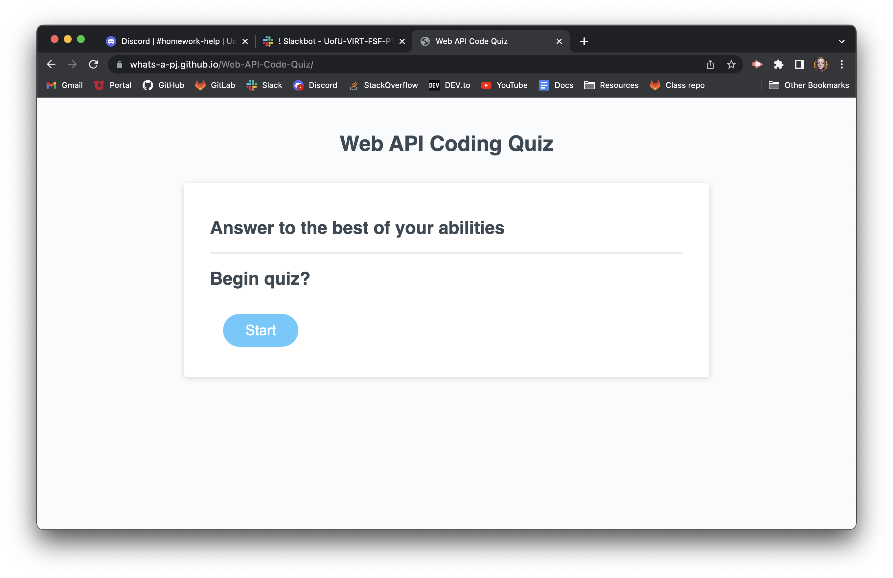
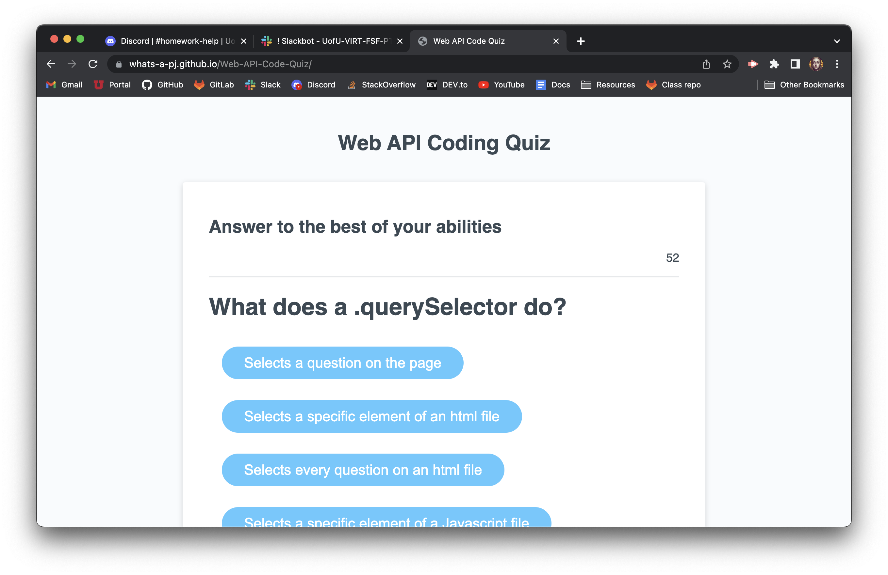
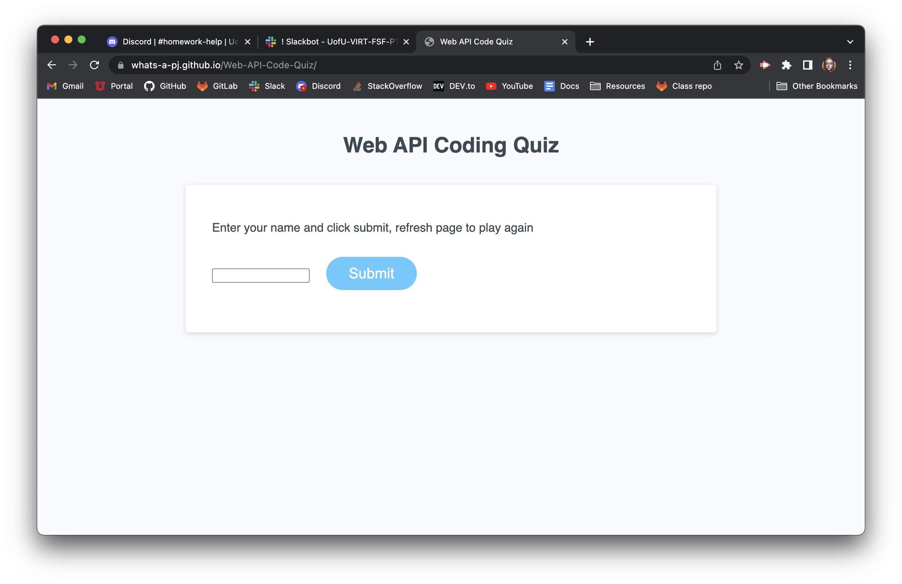
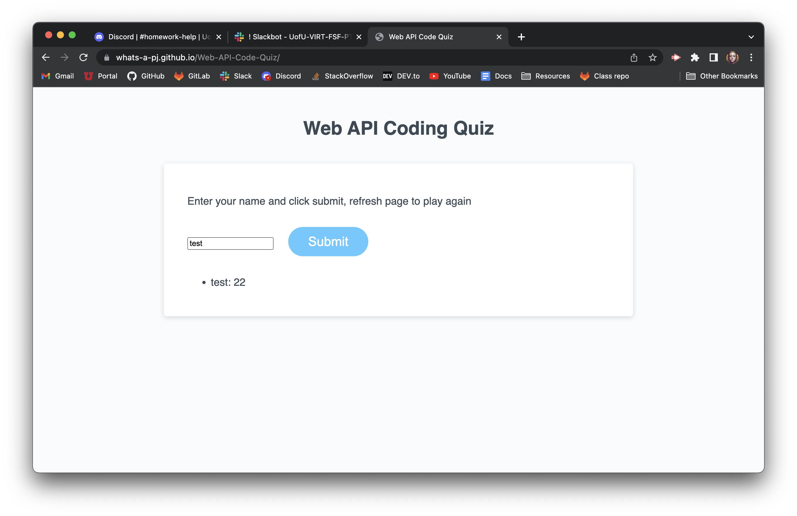

# Web-API-Code-Quiz
## Why was this project created?
I created this project so users learning to code can test their knowledge and to showcase my own knowledge in Javascript and web APIs.

## What this project has taught me
This project really put everything I've learned the last 2-3 weeks to the test. I learned more about the importance of global and local scope in my script.js file and how functions can work together. One of the things I struggled with most was using the web API methods correctly, I have spent well over 20 hours on this project doing extensive research on syntax and how some of the code I was using works. I have learned a great deal about how to make one big problem into a handful of smaller ones to solve the bigger picture.

 Link to live site & screenshot 

https://whats-a-pj.github.io/Web-API-Code-Quiz/

before you click start

after clicking start

submit page

after first submission

after taking the quiz multiple times- showing previous scores

 Process Summary 

 Credits 

I used these websites to help me complete the project as well as things to experiment with, seeing what does and doesn't work:

https://www.w3schools.com/tags/tag_output.asp

https://www.w3schools.com/js/js_output.asp

https://developer.mozilla.org/en-US/docs/Web/JavaScript/Reference/Global_Objects/Object/keys

https://developer.mozilla.org/en-US/docs/Web/JavaScript/Guide/Working_with_objects

https://developer.mozilla.org/en-US/docs/Web/JavaScript/Reference/Operators/Object_initializer

https://developer.mozilla.org/en-US/docs/Web/JavaScript/Reference/Global_Objects/Array/forEach

https://www.freecodecamp.org/news/javascript-array-of-objects-tutorial-how-to-create-update-and-loop-through-objects-using-js-array-methods/

https://www.tutorialstonight.com/javascript-loop-through-an-array-of-objects

https://www.w3schools.com/jsref/jsref_foreach.asp

https://www.w3schools.com/howto/howto_css_pagination.asp

https://www.w3schools.com/css/css3_pagination.asp

https://www.w3schools.com/tags/att_input_type_text.asp#:~:text=The%20%3Cinput%20type%3D%22text,tag%20for%20best%20accessibility%20practices!

https://www.w3schools.com/jsref/met_element_setattribute.asp

https://www.w3schools.com/jsref/met_element_removeattribute.asp

https://developer.mozilla.org/en-US/docs/Web/API/Element/replaceChildren#examples

https://www.w3schools.com/jsref/met_win_setinterval.asp

https://www.w3schools.com/jsref/met_win_settimeout.asp

https://www.washington.edu/accesscomputing/webd2/student/unit5/module2/lesson5.html#:~:text=To%20make%20the%20element%20visible,triggered%20by%20an%20onclick%20event.

I had a study group on 7/9 with Brian Whisler, Jeremy Rapich, Timothy Morgan and Salvador Mejia where we pretty much just talked about how hard this assignment was as opposed to really working on specific issues. We did brainstorm ways of implementing the problems we needed to solve based on the acceptance criteria though and that got some of the creative juices flowing.

I had help from J.K. and Oscarlos Gomez Rosario with AskBCS, they both helped guide me take the whole of the project and turn it into smaller easier tasks to solve in an order that would make creating the entire thing a smoother process, and sent me on a more clear path once I laid out most of the code I knew I would need to solve this challenge.

I had a tutoring session on 7/11 with Jacob Carver after struggling with this assignment for a week and exhausting my resources. I walked him through my code and he let me know I was actually on the right path which was very encouraging. He patiently walked me through why some of my functions weren't working correctly and made sure I understood what he meant along the way. 

Attended office hours in class with Jenae Luthi to get help with this as well, our TA CJ Sanders helped us understand the coding we needed a little bit more and some of the code I had already written so that I understood where I went wrong in some of my code.

